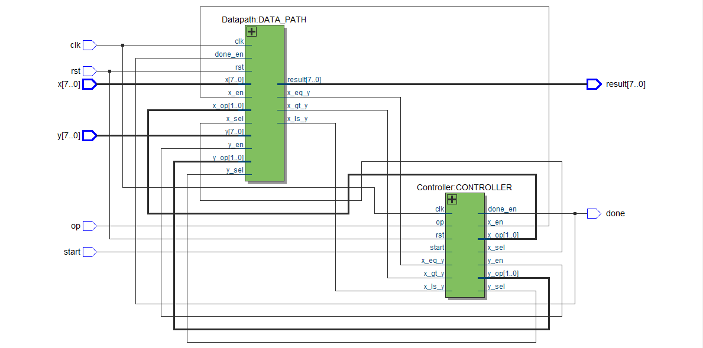
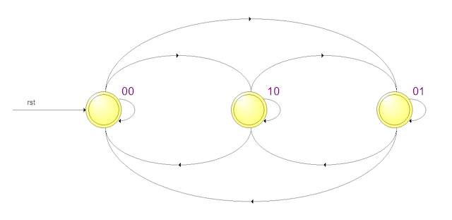
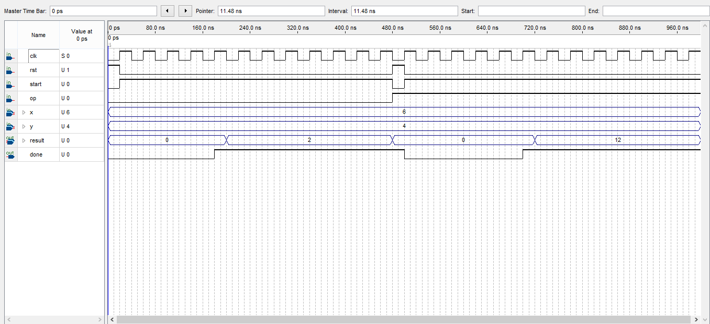

# Project

### Abstract
The main objective of this project was to build a special-purpose processor that can calculate greatest common multiple (GCM) and least common factor (LCM) based on input operation code (opcode). At first I design a datapath and controller for this processor and synchronized them with system clock that implemented using Verilog HDL language.
At the end I implement this code on FPGA. (Use Altera DE2-115 board and Cyclone IV EP4CE115 micro-controller)

#

#### System Design
For this processor, two main modules must have designed.
* Datapath : Contanis registers, multiplexers, ALU and comparator. Their values are updated according to the next state.
* Controller : Specify the next state based on datapath outputs.
#

#### State Machine
In the controller, the next state is specified based on comparator outputs. Three states are avialable for our state machine.

    

#### Testbench
The result of the system for calculating GCM and LCM for 6 and 4 inputs is shown below.

